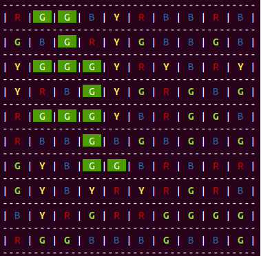

# Depth First Search
Implementation of a dfs in C++. 

Given a matrix of coloured tiles the algorithm will find the maximum number of adjoining tiles that are the same colour.
Both a recursive and iterative implementation is provided.

 